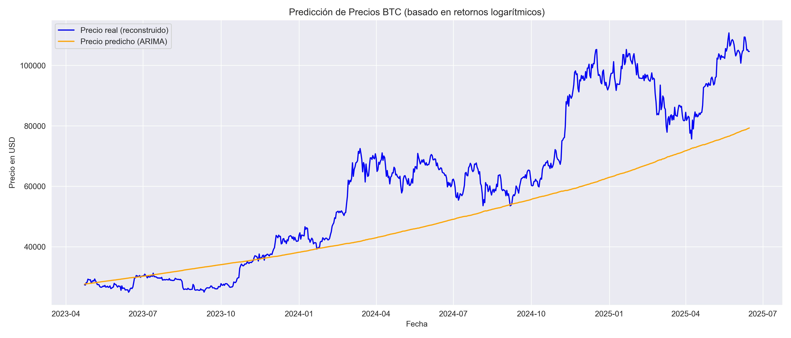
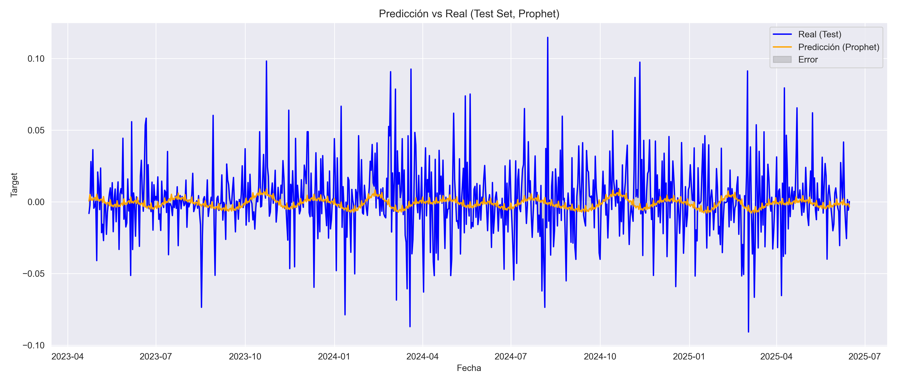
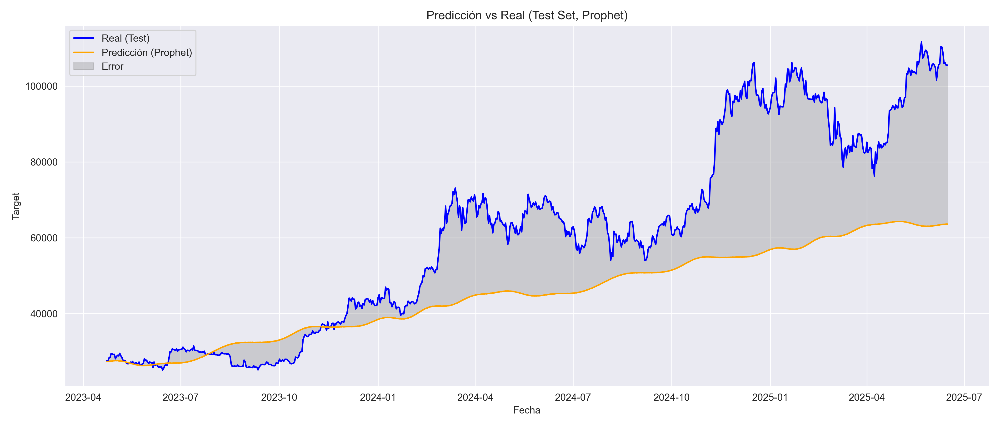
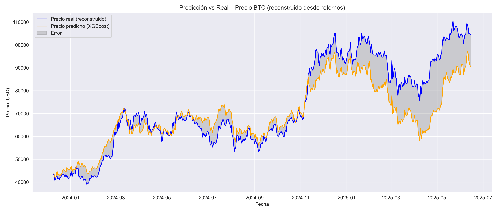
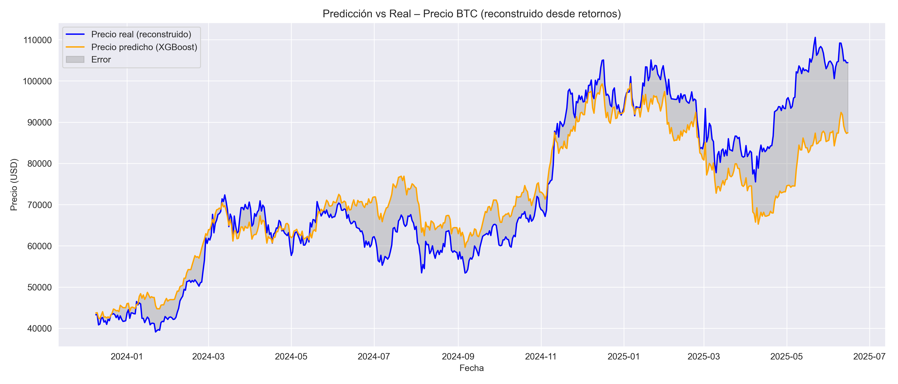
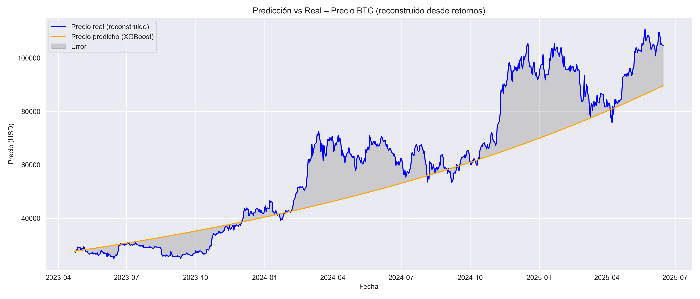

## 1. Motivación del trabajo

Bitcoin (BTC) es un activo financiero altamente volátil y descentralizado que ha despertado el interés de inversores, investigadores y analistas. A diferencia de activos tradicionales, su comportamiento está influenciado por factores diversos, incluyendo variables macroeconómicas, sentimiento del mercado, y eventos sociales o tecnológicos. En este trabajo se busca explorar diferentes enfoques de modelado de series de tiempo para anticipar el comportamiento futuro del precio de BTC.

Los objetivos principales del análisis incluyen:

- **Predicción del precio a partir del retorno histórico**:  
  Dado que los precios financieros son generalmente no estacionarios, se transforma la serie a *retornos logarítmicos*, lo que permite trabajar con una serie más estable para el modelado.

- **Predicción del precio a partir de variables exógenas**:  
  Se incorporan variables como el precio del S&P 500, ETH, el índice del dólar (DXY), tasas de interés de la Reserva Federal (FED), y datos de tendencia de búsqueda en Google sobre BTC, con el objetivo de detectar relaciones que puedan mejorar el poder predictivo de los modelos.

- **Detección de cambios de tendencia**:  
  Más allá del valor puntual, se evalúa la posibilidad de anticipar giros importantes en la dirección del precio (de alcista a bajista o viceversa), lo que tiene un valor estratégico para la toma de decisiones.

Estos enfoques se comparan entre sí en términos de precisión de pronóstico, significancia estadística y robustez temporal.

---

## 2. Limitaciones y desafíos

Es importante reconocer que el comportamiento del precio de BTC está influido por una combinación de factores determinísticos y aleatorios. Entre las principales limitaciones del modelado se destacan:

- **Eventos impredecibles**:  
  Cambios abruptos en el precio suelen estar asociados a sucesos difíciles de anticipar, como:
  - Hackeos de exchanges o wallets.
  - Cambios regulatorios en países con fuerte volumen.
  - Anuncios o tweets de figuras públicas influyentes.
  - Crisis financieras o tecnológicas.

- **No linealidad y cambios de régimen**:  
  BTC no sigue un comportamiento estable a lo largo del tiempo; las relaciones entre variables pueden cambiar radicalmente según el contexto (épocas de euforia vs. pánico).

- **Datos limitados o ruidosos**:  
  Algunas fuentes de información, como Google Trends o indicadores sociales, pueden introducir ruido y no reflejar causalidad directa.

- **Problemáticas de utilizar otras variables dependientes del tiempo**:
  Durante el desarrollo del trabajo, utilizaremos algunos modelos multivariados, que nos permitirán entrenar y predecir (para comparar con datos históricos) utilizando los datos históricos de otras variables como input.\
  Si se quisiese utilizar dichos modelos para predecir de aquí al futuro, se depende de variables cuyos valores en el futuro tampoco se conocen.\
  A este punto, hay al menos 2 opciones:
  - Crear modelos auxiliares para predecir las otras variables involucradas, y luego usar sus predicciones como input para tu modelo final, entendiendo el problema de acumular incertidumbre.
  - Asumir que ciertas variables se mantienen igual (si no son variables de mucha volatilidad) y limitar el uso del modelo a predecir ventanas de tiempo muy acotadas en el futuro (1-7 días)

Dicho esto, se planteará la separación de modelos univariados y multivariados.

Finalmente, este trabajo no pretende ofrecer un modelo de predicción perfecto, sino más bien una evaluación crítica y comparativa de diferentes enfoques, entendiendo tanto sus aportes como sus límites dentro del contexto real del mercado cripto.

---

## 3. Variables utilizadas en el análisis

Además del precio histórico de BTC, se incorporan diversas variables financieras y de sentimiento de mercado con el objetivo de enriquecer los modelos y capturar patrones más complejos. A continuación, se describen brevemente las principales variables utilizadas:

#### Activos financieros

- **S&P 500**  
  Principal índice bursátil estadounidense que agrupa a las 500 empresas más representativas. Se incluye como proxy del comportamiento del mercado financiero tradicional.

- **Ethereum (ETH)**  
  Segunda criptomoneda más importante en capitalización. Se utiliza para capturar movimientos sincronizados o divergencias dentro del ecosistema cripto.

- **Oro (Gold)**  
  Activo refugio clásico. Se incorpora para evaluar si BTC presenta correlaciones con activos percibidos como seguros en contextos de incertidumbre.

- **Índice del dólar (DXY)**  
  Mide el valor del dólar estadounidense frente a una canasta de monedas extranjeras. Se incluye para captar efectos macroeconómicos globales, ya que BTC suele moverse inversamente al dólar.

- **Tasa de interés de EE.UU. (Federal Funds Rate)**  
  Determinada por la Reserva Federal (FED), influye directamente en el costo del dinero. Se considera relevante por su impacto en activos de riesgo y flujos de capital.

#### Indicadores de actividad o sentimiento

- **Tendencias de búsqueda de “Bitcoin” en Google**  
  Variable de tipo “sentiment”. Se utiliza como aproximación al interés público o especulativo sobre BTC.

- **Fear and Greed Index (Índice de miedo y avaricia)**  
  Índice compuesto que intenta cuantificar el sentimiento del mercado cripto. Valores bajos indican miedo (posible piso); valores altos, avaricia (posible techo).

- **Direcciones activas de BTC**  
  Métrica on-chain que indica cuántas wallets participaron en transacciones en un período dado. Refleja la actividad en la red y puede asociarse a fases de acumulación o distribución.

- **Índice RSI (Relative Strength Index)**  
  Indicador técnico que mide la velocidad y cambio de los movimientos de precios. Se utiliza para detectar condiciones de sobrecompra o sobreventa.

### Fuente de los datos

| Origen                   | Serie descargada                         | Campo usado                               | Escala / Observaciones                                                                                                                                                                  |
| ------------------------ | ---------------------------------------- | ----------------------------------------- | --------------------------------------------------------------------------------------------------------------------------------------------------------------------------------------- |
| **Yahoo Finance**        | BTC‑USD, ETH‑USD, GC=F (Oro), DXY, ^GSPC | **Cierre ajustado** (*adjusted close*) | Se trabajará exclusivamente con el precio de **cierre**. El volumen diario quedó fuera del análisis principal, aunque podría incorporarse como predictor adicional en trabajos futuros. |
| **Google Trends**        | Búsqueda «Bitcoin»                       | Índice de popularidad                     | Valores normalizados de **0 a 100**. 100 = máximo interés en la ventana consultada.                                                                                                  |
| **Alternative.me**       | Fear & Greed Index                       | Índice diario                             | Rango **0 a 100**: 0 = “extreme fear”, 100 = “extreme greed”.                                                                                                                        |
| **Blockchain.com**       | Direcciones activas de BTC               | Total diario                              | Métrica on‑chain que refleja actividad en la red.                                                                                                                                       |
| **FRED (St. Louis Fed)** | Federal Funds Rate                       | Tasa (%)                                  | Requiere **API KEY** gratuita. Serie mensual forward‑filled a frecuencia diaria.                                                                                                     |

> **Nota sobre la transformación de precios**
> Para todos los activos descargados de Yahoo Finance se calculará el **retorno logarítmico**
>
> $$ r_t = \ln\!\bigl(\tfrac{P_t}{P_{t-1}}\bigr) $$
>
> Esta transformación reduce la no‑estacionariedad inherente a los precios, estabiliza la varianza y convierte multiplicaciones de rendimientos en sumas, facilitando el modelado con técnicas estadísticas y de machine learning.

> **Nota sobre el RSI (Relative Strength Index)**
> El **RSI** se calcula sobre la serie de cierre de BTC utilizando una ventana móvil de **14 días**, conforme a la definición tradicional de este indicador técnico.
> Su valor oscila entre 0 y 100, donde valores mayores a 70 indican potencial sobrecompra, y menores a 30, potencial sobreventa.

### 5. Descripción del DataFrame final

El conjunto de datos final cuenta con **3.925 observaciones diarias** y **22 columnas**. Integra información financiera, indicadores técnicos y métricas de sentimiento de mercado, tanto en su forma original como transformada. Las columnas incluyen:

* **Precios de activos financieros**
  Variables como `btc_close`, `eth_close`, `gold_close`, `sp500_close` y `dxy_close` corresponden a precios de cierre ajustado. Estos valores han sido utilizados como base para calcular retornos logarítmicos y otros indicadores.

* **Indicadores de actividad y sentimiento**
  Se incluyen métricas como `active_addresses` (direcciones activas en la red BTC), `fear_greed` (índice de miedo y codicia) y `trend` (tendencias de búsqueda de "Bitcoin" en Google Trends).

* **Variables macroeconómicas**
  `interest_rate` representa la tasa de interés objetivo fijada por la Reserva Federal de EE.UU., descargada de la API de la St. Louis Fed.

* **Indicadores técnicos y transformaciones estadísticas**
  A partir de las series originales se derivaron variables como:

  * `btc_log_return`, `eth_log_return`, `sp500_log_return`, `gold_log_return`, `dxy_log_return`: retornos logarítmicos diarios.
  * `btc_log_cumsum`: suma acumulada de los retornos logarítmicos de BTC (permite reconstruir la evolución del precio).
  * `btc_rsi`: índice RSI de BTC calculado sobre una ventana de 14 días.
  * `active_addresses_pct_change`: cambio porcentual diario en direcciones activas.
  * `trend_diff`: variación diaria en las tendencias de búsqueda.

> Algunas columnas presentan menos de 3.925 observaciones debido a faltantes históricos en fuentes como Google Trends, Fear & Greed o ETH, que comenzaron a reportar datos en fechas posteriores.
> Los valores faltantes fueron tratados cuidadosamente antes del entrenamiento de los modelos.

Este conjunto estructurado y enriquecido permite implementar tanto **modelos univariados** (focalizados en el comportamiento propio de BTC) como **multivariados** (que integran información contextual o correlacionada para mejorar la capacidad predictiva).

Como mencionamos anteriormente, estas variables no se utilizarán todas en todos los modelos, pero servirán para explorar su poder predictivo tanto individual como combinado, en modelos multivariados y de machine learning.

---

## 4. Modelos

### ARIMA

Es un modelo estadístico clásico para series de tiempo univariadas. Se compone de tres componentes:

- **AR (AutoRegressive)**: utiliza dependencias lineales con valores pasados.
- **I (Integrated)**: aplica diferenciación para lograr estacionariedad.
- **MA (Moving Average)**: ajusta errores residuales de predicciones anteriores.

En este trabajo, se utilizó ARIMA para predecir el **retorno logarítmico diario del precio de Bitcoin (BTC)**.

##### _Estacionariedad_

 Se verificó su mediante el test ADF:

  ===== Test de Estacionariedad ADF =====
  - ADF Statistic: -19.02553917226454
  - p-value: 0.0
  - Valores críticos:
  Nivel 1%: -3.43
  Nivel 5%: -2.86
  Nivel 10%: -2.56

> Podemos ver que el p-valor es cero, menor a 0.05 y por lo tanto es estacionaria. También podemos utilizar el estadístico ADF y decir que al ser mucho menor al nivel más crítico de los valores críticos la serie es estacionaria. Usaremos d=0

##### _Búsqueda de parámetros_

Se utilizó `auto_arima` para seleccionar automáticamente los parámetros óptimos `(p, q)` minimizando el AIC.

> Modelo elegido: **ARIMA(1, 0, 0)**

##### _Resultados_

El modelo fue entrenado con el 70% de los datos y evaluado en el 30% restante.

| Métrica | Valor  |
|---------|--------|
| **MAE** | 13.481 |
| **RMSE**| 17.624 |

- El modelo logra seguir la dirección general de los retornos.
- Tiende a **suavizar la predicción** y subestima movimientos bruscos.

##### _Conclusión_

- ARIMA es simple, eficiente y adecuado como baseline.
- No captura bien shocks abruptos ni relaciones no lineales.
- Es útil como referencia inicial en comparación con modelos más complejos.

### GARCH

### VAR

### Prophet

es una herramienta desarrollada por Facebook (Meta) para modelar y predecir series temporales de forma automática. Está diseñada para capturar:

- **Tendencias** (lineales o logísticas)
- **Estacionalidades** (diarias, semanales, anuales)
- **Cambios estructurales** mediante puntos de cambio (“changepoints”)

Su enfoque aditivo permite descomponer la serie como:

y(t) = g(t) + s(t) + h(t) + epsilon_t

Donde:

- g(t): tendencia
- s(t): estacionalidad
- h(t): efectos externos (como feriados)
- epsilon_t: error

#### _Implementación `btc_log_return`_

- Prophet tiende a suavizar en exceso la serie de retornos.
- No captura bien la alta volatilidad diaria del BTC.
- Genera una curva de predicción oscilante que no sigue los picos abruptos del retorno real.

| Métrica | Valor  |
|---------|--------|
| **MAE** | 0.0177 |
| **RMSE**| 0.0251 |

> Aunque los valores son similares a ARIMA, el comportamiento visual muestra **underfitting**: el modelo no logra adaptarse a los movimientos rápidos.

#### _Implementación `btc_close`_

Inicialmente, Prophet mostró un mal ajuste sobre el precio debido a su suposición de tendencias suaves.

Se mejoró la performance aumentando el número de puntos de cambio:

Prophet(n_changepoints=100, changepoint_range=1.0)

| Métrica | Valor  |
|---------|--------|
| **MAE** | 16.792 |
| **RMSE**| 22.049 |

> Aún con mejor rendimiento que al inicio, el modelo tiende a subestimar crecimientos exponenciales y no modela bien eventos no recurrentes.

##### _Conclusión_

- Prophet es muy útil para series con tendencias suaves y estacionalidad clara.
- No es ideal para series con alta volatilidad y sin estructura periódica clara como los retornos de BTC.
- Su capacidad de detección de cambios puede aprovecharse con configuraciones ajustadas.

### Movimiento browniano geométrico

### LSTM

### XGBoost

es un modelo de aprendizaje automático basado en árboles de decisión optimizados mediante boosting. Es ampliamente utilizado por su:

- Alta precisión
- Capacidad de manejar relaciones no lineales
- Robustez ante outliers y ruido
- Soporte para múltiples features

#### _Implementación con features_

Se utilizó XGBoost para predecir el **retorno logarítmico diario del BTC (`btc_log_return`)**. Para ello, se construyó un conjunto de features que incluye:

- **Lags** del retorno: `lag_1`, `lag_2`, `lag_3`
- **Regresores externos**:
  - `eth_log_return` (Ethereum)
  - `sp500_log_return` (S&P 500)
  - `gold_log_return` (Oro)
  - `dxy_log_return` (Índice del dólar)

| Métrica | Valor |
|---------|-------|
| **MAE** | 7.137 |
| **RMSE**| 9.486 |

#### _Implementación con features optimizado_

Gracias a Optuna buscamos los parámetros que minimiza RMSE 

| Métrica | Valor |
|---------|-------|
| **MAE** | 6.558 |
| **RMSE**| 8.506 |

#### _Implementación sin features optimizado_

Gracias a Optuna buscamos los parámetros que minimiza RMSE y no utilizamos features distintos al target (y sus lags)

| Métrica | Valor  |
|---------|--------|
| **MAE** | 9.943  |
| **RMSE**| 13.524 |

#### _Conclusiones_

El análisis de importancia de features mostró que los lags del propio retorno de BTC y el eth_log_return fueron los más influyentes, seguidos por sp500_log_return.

XGBoost
- Es capaz de modelar relaciones complejas y no lineales.
- Requiere más ingeniería de features, pero permite mayor control y personalización.
- Es ideal cuando se cuenta con regresores múltiples y objetivos ruidosos como los retornos de BTC.

---

## 5. Resultados

---

## 6. Conclusiones
