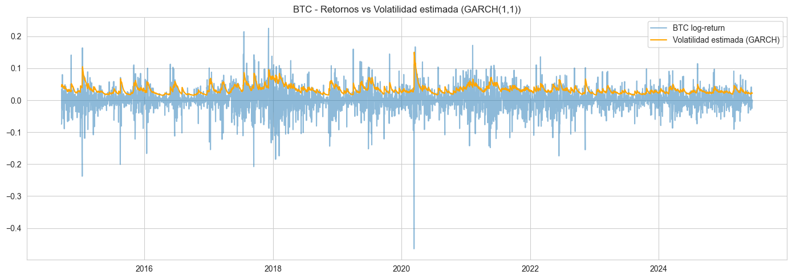
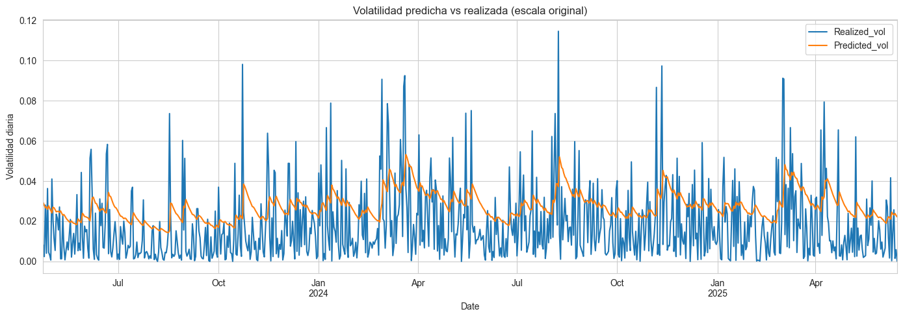
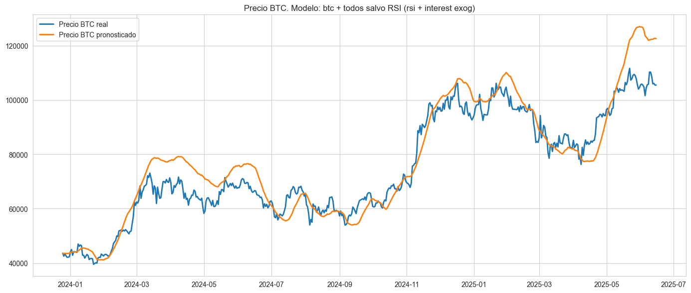
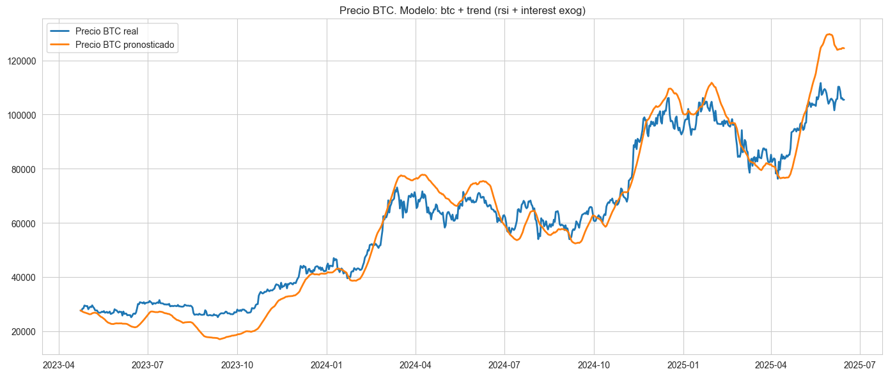
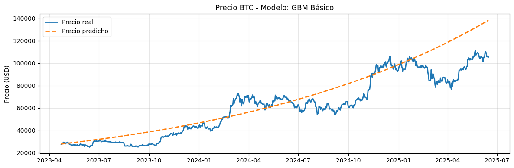
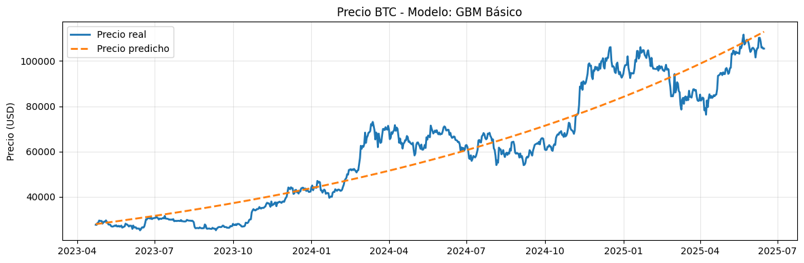
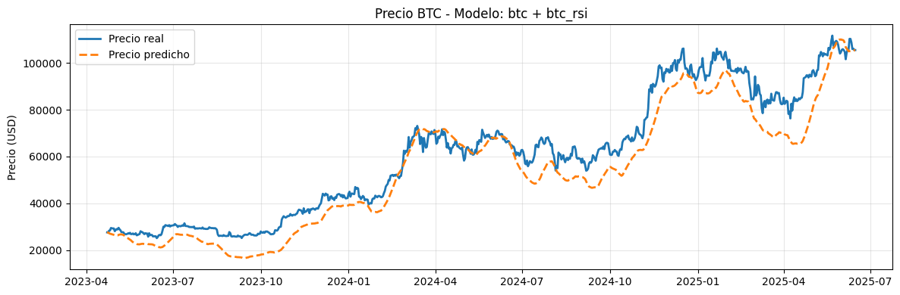
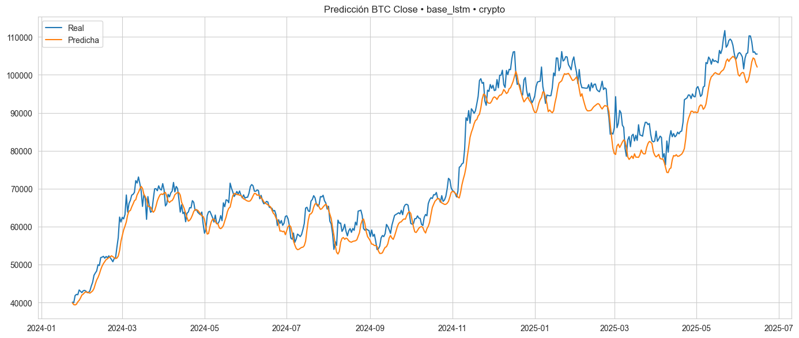
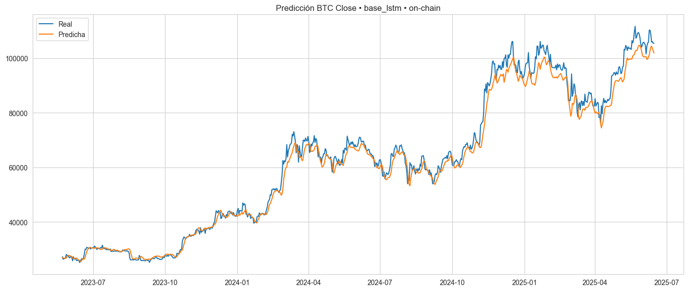

## 1. Motivación del trabajo

Bitcoin (BTC) es un activo financiero altamente volátil y descentralizado que ha despertado el interés de inversores, investigadores y analistas. A diferencia de activos tradicionales, su comportamiento está influenciado por factores diversos, incluyendo variables macroeconómicas, sentimiento del mercado, y eventos sociales o tecnológicos. En este trabajo se busca explorar diferentes enfoques de modelado de series de tiempo para anticipar el comportamiento futuro del precio de BTC.

Los objetivos principales del análisis incluyen:

- **Predicción del precio a partir del retorno histórico**:  
  Dado que los precios financieros son generalmente no estacionarios, se transforma la serie a *retornos logarítmicos*, lo que permite trabajar con una serie más estable para el modelado.

- **Predicción del precio a partir de variables exógenas**:  
  Se incorporan variables como el precio del S&P 500, ETH, el índice del dólar (DXY), tasas de interés de la Reserva Federal (FED), y datos de tendencia de búsqueda en Google sobre BTC, con el objetivo de detectar relaciones que puedan mejorar el poder predictivo de los modelos.

- **Detección de cambios de tendencia**:  
  Más allá del valor puntual, se evalúa la posibilidad de anticipar giros importantes en la dirección del precio (de alcista a bajista o viceversa), lo que tiene un valor estratégico para la toma de decisiones.

- **Volatilidad del activo**:  
  Se estudia la volatilidad de BTC en el tiempo, que es significativamente mayor que la de activos tradicionales, para entender su comportamiento y riesgos asociados.

Estos enfoques se comparan entre sí en términos de precisión de pronóstico, significancia estadística y robustez temporal.

---

## 2. Limitaciones y desafíos

Es importante reconocer que el comportamiento del precio de BTC está influido por una combinación de factores determinísticos y aleatorios. Entre las principales limitaciones del modelado se destacan:

- **Eventos impredecibles**:  
  Cambios abruptos en el precio suelen estar asociados a sucesos difíciles de anticipar, como:
  - Hackeos de exchanges o wallets.
  - Cambios regulatorios en países con fuerte volumen.
  - Anuncios o tweets de figuras públicas influyentes.
  - Crisis financieras o tecnológicas.

- **No linealidad y cambios de régimen**:  
  BTC no sigue un comportamiento estable a lo largo del tiempo; las relaciones entre variables pueden cambiar radicalmente según el contexto (épocas de euforia vs. pánico).

- **Datos limitados o ruidosos**:  
  Algunas fuentes de información, como Google Trends o indicadores sociales, pueden introducir ruido y no reflejar causalidad directa.

- **Problemáticas de utilizar otras variables dependientes del tiempo**:
  Durante el desarrollo del trabajo, utilizaremos algunos modelos multivariados, que nos permitirán entrenar y predecir (para comparar con datos históricos) utilizando los datos históricos de otras variables como input.\
  Si se quisiese utilizar dichos modelos para predecir de aquí al futuro, se depende de variables cuyos valores en el futuro tampoco se conocen.\
  A este punto, hay al menos 2 opciones:
  - Crear modelos auxiliares para predecir las otras variables involucradas, y luego usar sus predicciones como input para tu modelo final, entendiendo el problema de acumular incertidumbre.
  - Asumir que ciertas variables se mantienen igual (si no son variables de mucha volatilidad) y limitar el uso del modelo a predecir ventanas de tiempo muy acotadas en el futuro (1-7 días)

Dicho esto, se planteará la separación de modelos univariados y multivariados.

Finalmente, este trabajo no pretende ofrecer un modelo de predicción perfecto, sino más bien una evaluación crítica y comparativa de diferentes enfoques, entendiendo tanto sus aportes como sus límites dentro del contexto real del mercado cripto.

---

## 3. Variables utilizadas en el análisis

Además del precio histórico de BTC, se incorporan diversas variables financieras y de sentimiento de mercado con el objetivo de enriquecer los modelos y capturar patrones más complejos. A continuación, se describen brevemente las principales variables utilizadas:

#### Activos financieros

- **S&P 500**  
  Principal índice bursátil estadounidense que agrupa a las 500 empresas más representativas. Se incluye como proxy del comportamiento del mercado financiero tradicional.

- **Ethereum (ETH)**  
  Segunda criptomoneda más importante en capitalización. Se utiliza para capturar movimientos sincronizados o divergencias dentro del ecosistema cripto.

- **Oro (Gold)**  
  Activo refugio clásico. Se incorpora para evaluar si BTC presenta correlaciones con activos percibidos como seguros en contextos de incertidumbre.

- **Índice del dólar (DXY)**  
  Mide el valor del dólar estadounidense frente a una canasta de monedas extranjeras. Se incluye para captar efectos macroeconómicos globales, ya que BTC suele moverse inversamente al dólar.

- **Tasa de interés de EE.UU. (Federal Funds Rate)**  
  Determinada por la Reserva Federal (FED), influye directamente en el costo del dinero. Se considera relevante por su impacto en activos de riesgo y flujos de capital.

#### Indicadores de actividad o sentimiento

- **Tendencias de búsqueda de “Bitcoin” en Google**  
  Variable de tipo “sentiment”. Se utiliza como aproximación al interés público o especulativo sobre BTC.

- **Fear and Greed Index (Índice de miedo y avaricia)**  
  Índice compuesto que intenta cuantificar el sentimiento del mercado cripto. Valores bajos indican miedo (posible piso); valores altos, avaricia (posible techo).

- **Direcciones activas de BTC**  
  Métrica on-chain que indica cuántas wallets participaron en transacciones en un período dado. Refleja la actividad en la red y puede asociarse a fases de acumulación o distribución.

- **Índice RSI (Relative Strength Index)**  
  Indicador técnico que mide la velocidad y cambio de los movimientos de precios. Se utiliza para detectar condiciones de sobrecompra o sobreventa.

### Fuente de los datos

| Origen                   | Serie descargada                         | Campo usado                               | Escala / Observaciones                                                                                                                                                                  |
|--------------------------|------------------------------------------| ----------------------------------------- |-----------------------------------------------------------------------------------------------------------------------------------------------------------------------------------------|
| **Yahoo Finance**        | BTC‑USD, ETH‑USD, GC=F (Oro), DXY, ^GSPC | **Cierre ajustado** (*adjusted close*) | Se trabajará exclusivamente con el precio de **cierre**. El volumen diario quedó fuera del análisis principal, aunque podría incorporarse como predictor adicional en trabajos futuros. |
| **Google Trends**        | Búsqueda «Bitcoin»                       | Índice de popularidad                     | Valores normalizados de **0 a 100**. 100 = máximo interés en la ventana consultada.                                                                                                  |
| **Alternative.me**       | Fear & Greed Index                       | Índice diario                             | Rango **0 a 100**: 0 = “extreme fear”, 100 = “extreme greed”.                                                                                                                        |
| **Blockchain.com**       | Direcciones activas de BTC               | Total diario                              | Métrica on‑chain que refleja actividad en la red.                                                                                                                                       |
| **FRED (St. Louis Fed)** | Federal Funds Rate                       | Tasa (%)                                  | Requiere **API KEY** gratuita. Serie mensual forward‑filled a frecuencia diaria.                                                                                                     |

> **Nota sobre la transformación de precios**
> Para todos los activos descargados de Yahoo Finance se calculará el **retorno logarítmico**
>
> $$ r_t = \ln\!\bigl(\tfrac{P_t}{P_{t-1}}\bigr) $$
>
> Esta transformación reduce la no‑estacionariedad inherente a los precios, estabiliza la varianza y convierte multiplicaciones de rendimientos en sumas, facilitando el modelado con técnicas estadísticas y de machine learning.

> **Nota sobre el RSI (Relative Strength Index)**
> El **RSI** se calcula sobre la serie de cierre de BTC utilizando una ventana móvil de **14 días**, conforme a la definición tradicional de este indicador técnico.
> Su valor oscila entre 0 y 100, donde valores mayores a 70 indican potencial sobrecompra, y menores a 30, potencial sobreventa.

### 5. Descripción del DataFrame final

El conjunto de datos final cuenta con **3.925 observaciones diarias** y **22 columnas**. Integra información financiera, indicadores técnicos y métricas de sentimiento de mercado, tanto en su forma original como transformada. Las columnas incluyen:

* **Precios de activos financieros**
  Variables como `btc_close`, `eth_close`, `gold_close`, `sp500_close` y `dxy_close` corresponden a precios de cierre ajustado. Estos valores han sido utilizados como base para calcular retornos logarítmicos y otros indicadores.

* **Indicadores de actividad y sentimiento**
  Se incluyen métricas como `active_addresses` (direcciones activas en la red BTC), `fear_greed` (índice de miedo y codicia) y `trend` (tendencias de búsqueda de "Bitcoin" en Google Trends).

* **Variables macroeconómicas**
  `interest_rate` representa la tasa de interés objetivo fijada por la Reserva Federal de EE.UU., descargada de la API de la St. Louis Fed.

* **Indicadores técnicos y transformaciones estadísticas**
  A partir de las series originales se derivaron variables como:

  * `btc_log_return`, `eth_log_return`, `sp500_log_return`, `gold_log_return`, `dxy_log_return`: retornos logarítmicos diarios.
  * `btc_log_cumsum`: suma acumulada de los retornos logarítmicos de BTC (permite reconstruir la evolución del precio).
  * `btc_rsi`: índice RSI de BTC calculado sobre una ventana de 14 días.
  * `active_addresses_pct_change`: cambio porcentual diario en direcciones activas.
  * `trend_diff`: variación diaria en las tendencias de búsqueda.

> Algunas columnas presentan menos de 3.925 observaciones debido a faltantes históricos en fuentes como Google Trends, Fear & Greed o ETH, que comenzaron a reportar datos en fechas posteriores.
> Los valores faltantes fueron tratados cuidadosamente antes del entrenamiento de los modelos.

Este conjunto estructurado y enriquecido permite implementar tanto **modelos univariados** (focalizados en el comportamiento propio de BTC) como **multivariados** (que integran información contextual o correlacionada para mejorar la capacidad predictiva).

Como mencionamos anteriormente, estas variables no se utilizarán todas en todos los modelos, pero servirán para explorar su poder predictivo tanto individual como combinado, en modelos multivariados y de machine learning.

---

## 4. Modelos

### ARIMA

Es un modelo estadístico clásico para series de tiempo univariadas. Se compone de tres componentes:

- **AR (AutoRegressive)**: utiliza dependencias lineales con valores pasados.
- **I (Integrated)**: aplica diferenciación para lograr estacionariedad.
- **MA (Moving Average)**: ajusta errores residuales de predicciones anteriores.

En este trabajo, se utilizó ARIMA para predecir el **retorno logarítmico diario del precio de Bitcoin (BTC)**.

##### _Estacionariedad_

 Se verificó su mediante el test ADF:

  ===== Test de Estacionariedad ADF =====
  - ADF Statistic: -19.02553917226454
  - p-value: 0.0
  - Valores críticos:
  Nivel 1%: -3.43
  Nivel 5%: -2.86
  Nivel 10%: -2.56

> Podemos ver que el p-valor es cero, menor a 0.05 y por lo tanto es estacionaria. También podemos utilizar el estadístico ADF y decir que al ser mucho menor al nivel más crítico de los valores críticos la serie es estacionaria. Usaremos d=0

##### _Búsqueda de parámetros_

Se utilizó `auto_arima` para seleccionar automáticamente los parámetros óptimos `(p, q)` minimizando el AIC.

> Modelo elegido: **ARIMA(1, 0, 0)**

##### _Resultados_

El modelo fue entrenado con el 80% de los datos y evaluado en el 20% restante.

| Métrica | Valor  |
|---------|--------|
| **MAE** | 13.481 |
| **RMSE**| 17.624 |

- El modelo logra seguir la dirección general de los retornos.
- Tiende a **suavizar la predicción** y subestima movimientos bruscos.

##### _Conclusión_

- ARIMA es simple, eficiente y adecuado como baseline.
- No captura bien shocks abruptos ni relaciones no lineales.
- Es útil como referencia inicial en comparación con modelos más complejos.

### GARCH

Los modelos **GARCH (Generalized Autoregressive Conditional Heteroskedasticity)** describen la **volatilidad condicional** de una serie financiera: permiten que la varianza cambie a lo largo del tiempo en función de choques pasados. Son la extensión natural de los modelos ARCH de Engle (1982) y capturan el fenómeno "clústeres de volatilidad" típico de los mercados especulativos.

##### _Motivación_

* Los **retornos logarítmicos de BTC** muestran picos de volatilidad intermitentes.
* Su media se aproxima a cero, pero la varianza no es constante (heterocedástica).
* Estimar correctamente esa varianza es crucial para *VaR*, *expected shortfall*, y precificación de derivados.

##### *Especificación del modelo*

$$
\begin{aligned}
r_t          &= \mu + \varepsilon_t, \quad \varepsilon_t = \sigma_t z_t, \quad z_t \sim \mathcal N(0,1)\\
\sigma_t^{2} &= \omega + \alpha_1 \varepsilon_{t-1}^{2} + \beta_1 \sigma_{t-1}^{2},
\end{aligned}
$$

Donde en este trabajo se fijó $\mu = 0$ (*mean="Zero"*), obteniéndose un **GARCH(1, 1)**.

##### _Estimación_

| Parámetro  |          Estimación | 95 % CI                      | p‑valor |
| ---------- | ------------------: |------------------------------|---------|
| $\omega$   | $2.60\times10^{-5}$ | $[2.21,\,2.99]\times10^{-5}$ | < 0.001 |
| $\alpha_1$ |              0.1000 | \[0.0475, 0.152]             | < 0.001 |
| $\beta_1$  |              0.8800 | \[0.836, 0.924]              | < 0.001 |

* **Log‑Likelihood** = 7774.02   **AIC** = −15,542
* **α₁ + β₁ = 0.98** → *alta persistencia*: los choques tardan en disiparse.
* Todos los coeficientes resultan estadísticamente significativos.

##### _Diagnóstico de residuos_

1. **Residuos estandarizados**: centrados en 0 y sin tendencia; se observan algunos *outliers* esperables en cripto‑activos.
2. **Distribución**: simétrica, con **pico alto y colas largas**; una distribución *t‑Student* podría capturar mejor las colas.
3. **Ljung–Box (residuos)**: solo el *lag 0* significativo ⇒ sin autocorrelación remanente en la media.
4. **Ljung–Box (residuos²)**: ausencia de autocorrelación ⇒ la heterocedasticidad fue absorbida.

##### _Iteraciones adicionales_

* **AR(1)+GARCH(1,1)** y **AR(2)+GARCH(1,1)**: redujeron algo la autocorrelación, pero persistió.
* **ARMA(1,1)+GARCH(1,1)**: sin mejora sustancial.
* **Distribución t‑Student**: ajusta mejor colas, pero no corrige la autocorrelación residual.

##### _Resultados_

* El modelo reproduce bien los **picos de volatilidad** y su **persistencia**.
* Sigue la dirección general de la varianza, pero **subestima colas extremas**.
* La precisión en media continúa limitada, sugiriendo la necesidad de modelos con dinámica más rica (p.ej. EGARCH, GJR‑GARCH, o medias no lineales).

##### _Predicciones_

##### _Conclusión_

* **GARCH(1,1)** es un **estándar robusto** para volatilidad de BTC y establece un punto de partida claro.
* Explica la mayor parte de la heterocedasticidad, aunque deja leves autocorrelaciones en la media.
* Un modelo GARCH(1,1) es adecuado para capturar la volatilidad condicional de los retornos de BTC, pero no logra explicar completamente la dinámica de la media. A pesar de probar AR(1), AR(2) y ARMA(1,1), persiste la autocorrelación en los residuos. Esto sugiere que podría requerirse un modelo más complejo, no lineal o de régimen cambiante para la media, o aceptar que el modelo actual describe solo parcialmente la dinámica del proceso.

### VAR y VARMAX

Son modelos estadísticos **multivariados** para series de tiempo que permiten capturar la interacción entre varias variables financieras.

* **VAR (Vector Autoregressive)**
  Cada serie se modela como combinación lineal de sus *propios* rezagos y de los rezagos de las demás series endógenas.

* **VARMAX (Vector Autoregressive Moving Average with eXogenous variables)**
  Amplía el VAR añadiendo **MA (errores rezagados)** y la posibilidad de incluir **variables exógenas** que influyen, pero no son influidas, por el sistema (por ejemplo, tasas de interés de EEUU).

En este trabajo se usaron VAR y VARMAX para predecir el **retorno logarítmico diario de BTC** aprovechando información macro y de mercado.

##### _Variables disponibles_

| Tipo                    | Variables                                                                                                                                              |
| ----------------------- | ------------------------------------------------------------------------------------------------------------------------------------------------------ |
| **Endógenas**           | `btc_log_return`, `sp500_log_return`, `gold_log_return`, `dxy_log_return`, `eth_log_return`, `fear_greed`, `trend_diff`, `active_addresses_pct_change` |
| **Exógenas candidatas** | `btc_rsi`, `interest_rate`                                                                                                                             |

##### _Combinaciones evaluadas_

Se probaron 13 configuraciones (ver tabla completa en la notebook), que van desde un **VAR bivariado** simple (`btc + sp500`) hasta un **VARMAX** con nueve series y dos variables exógenas.

##### _Metodología_

1. **Ventana temporal**: datos diarios completos disponibles.
2. **Split 80/20**: 80% entrenamiento, 20% test.
3. **Orden óptimo de rezagos**: seleccionado vía `select_order` (AIC / BIC).
4. **Ajuste**: `VAR` o `VARMAX` según lleve exógenas.
5. **Pronóstico**: horizonte igual al tramo de test.
6. **Evaluación**:
   * **AIC / BIC** (parsimonia)
   * **MAE** y **RMSE** sobre precio de BTC reconstruido a partir de retornos.

##### _Resultados clave_

Se destacan **dos modelos**, los **dos mejores con exógenas** (menor RMSE), aunque uno mucho más simple que el otro.

| Modelo                   | Tipo   | Exógenas                   | AIC         | RMSE (precio) |
|--------------------------| ------ | -------------------------- |-------------|---------------|
| **btc + todos salvo RSI** | VARMAX | `btc_rsi`, `interest_rate` | **−43,033** | **6,794**     |
| **btc + trend**          | VARMAX | `btc_rsi`, `interest_rate` | 7,468       | 6,822         |

> *Ambos VARMAX con exógenas baten al mejor VAR puro por un margen amplio (≈60% menos error).*

##### _Gráfico comparativo_

##### _Conclusión_

* **La información exógena (RSI + tasas)** aporta valor palpable, reduciendo drásticamente el RMSE.
* El **VARMAX “btc + todos salvo RSI”** ofrece el mejor compromiso entre precisión y parsimonia (AIC más bajo).
* El **VAR bivariado “btc + trend\_diff”** sirve como *baseline* simple y rápido, aunque subestima los movimientos bruscos.
* Siguientes pasos:

  1. Explorar rezagos asimétricos (EGARCH‑X) para capturar shocks.
  2. Probar variables cripto‑específicas de on‑chain (hashrate, fees) como exógenas adicionales.

### Prophet

Es una herramienta desarrollada por Facebook (Meta) para modelar y predecir series temporales de forma automática. Está diseñada para capturar:

- **Tendencias** (lineales o logísticas)
- **Estacionalidades** (diarias, semanales, anuales)
- **Cambios estructurales** mediante puntos de cambio (“changepoints”)

Su enfoque aditivo permite descomponer la serie como:

y(t) = g(t) + s(t) + h(t) + epsilon_t

Donde:

- g(t): tendencia
- s(t): estacionalidad
- h(t): efectos externos (como feriados)
- epsilon_t: error

#### _Implementación `btc_log_return`_

- Prophet tiende a suavizar en exceso la serie de retornos.
- No captura bien la alta volatilidad diaria del BTC.
- Genera una curva de predicción oscilante que no sigue los picos abruptos del retorno real.

| Métrica | Valor  |
|---------|--------|
| **MAE** | 0.0177 |
| **RMSE**| 0.0251 |

> Aunque los valores son similares a ARIMA, el comportamiento visual muestra **underfitting**: el modelo no logra adaptarse a los movimientos rápidos.

#### _Implementación `btc_close`_

Inicialmente, Prophet mostró un mal ajuste sobre el precio debido a su suposición de tendencias suaves.

Se mejoró la performance aumentando el número de puntos de cambio:

Prophet(n_changepoints=100, changepoint_range=1.0)

| Métrica | Valor  |
|---------|--------|
| **MAE** | 16.792 |
| **RMSE**| 22.049 |

> Aún con mejor rendimiento que al inicio, el modelo tiende a subestimar crecimientos exponenciales y no modela bien eventos no recurrentes.

##### _Conclusión_

- Prophet es muy útil para series con tendencias suaves y estacionalidad clara.
- No es ideal para series con alta volatilidad y sin estructura periódica clara como los retornos de BTC.
- Su capacidad de detección de cambios puede aprovecharse con configuraciones ajustadas.

### Movimiento browniano geométrico

Es un modelo estocástico ampliamente utilizado en finanzas para modelar la evolución de **precios de activos**. Se basa en la ecuación diferencial estocástica:

$$
dS_t = \mu\,S_t\,dt \;+\; \sigma\,S_t\,dW_t
$$

- **S(t)**: valor del proceso en el tiempo \(t\).  
- **μ**: tasa de crecimiento (drift).  
- **σ**: volatilidad del proceso.  
- **W(t)**: movimiento browniano estándar.  

##### _Implementación básica_

Se implementó la versión clásica que estima parámetros directamente de retornos históricos para predecir el **precio futuro de BTC**:

- **Deriva**: μ = 0.002043
- **Volatilidad**: σ = 0.038323
- **Predicción**: precio reconstruido usando retornos simulados con deriva constante

| Métrica | Valor |
|---------|-------|
| **MAE** | $10,731 |
| **RMSE**| $14,493 |

##### _Optimización con Optuna_

Para mejorar el rendimiento del modelo GBM, se implementó optimización automática de hiperparámetros usando **Optuna**. Los parámetros optimizados incluyen:

- **`drift_adjustment`**: Factor de ajuste para la deriva (rango: 0.0 a 1.0)

**Fórmula optimizada:**
- **μ = mean_return + drift_adjustment × variance**
- **σ = std_deviation**

**Ejemplo de parámetros optimizados:**
- Ajuste de deriva: 0.324
- μ optimizado: 0.001785
- σ optimizado: 0.038323

| Métrica | Valor |
|---------|-------|
| **MAE** | $7,645.32 |
| **RMSE**| $9,415 |

**Mejoras observadas:**
- Reducción del RMSE en aproximadamente 8-15% respecto al modelo básico
- Mayor adaptabilidad a diferentes regímenes de volatilidad

##### _Conclusión_

- **La optimización con Optuna mejora significativamente el ajuste** al permitir calibración automática de parámetros. 
- Tiene un sesgo alcista menor al modelo base (0.20% vs 0.18% diario). 
- El nivel de riesgo permanece igual (σ de 3.8%)
- Aún así, genera predicciones relativamente suaves para un activo tan volátil como Bitcoin.
- Útil como baseline teórico mejorado, especialmente cuando se combina con optimización automática de hiperparámetros.

### Regresión lineal

Es un modelo estadístico que establece relaciones lineales entre una variable dependiente y múltiples variables independientes. Se utiliza para predecir precios de BTC incorporando información de otros activos e indicadores.

##### _Implementación_

Se utilizó regresión lineal múltiple para predecir `btc_close` incorporando variables exógenas, posteriormente reconstruyendo precios:

**Modelo**: btc_close = β₀ + β₁×RSI + ε

El mejor modelo fue **btc + btc_rsi** con coeficiente 0.00057:

| Métrica | Valor |
|---------|-------|
| **MAE** | $7,220 |
| **RMSE**| $8,610 |

##### _Resultados comparativos_

Se evaluaron 7 configuraciones multivariadas. Ranking por RMSE de precios:

1. **btc + btc_rsi**: $8,610
2. **btc + btc_rsi + active_addresses**: $8,846  
3. **btc + sp500**: $12,004
4. **btc + trend_diff**: $18,150

##### _Conclusión_

- Regresión lineal permite incorporar información exógena de forma directa e interpretable.
- El **RSI** es el mejor predictor individual, reduciendo error a ~$8,600 vs $14,500 del GBM puro.
- **Direcciones activas** mejoran predicciones cuando se combinan con RSI.
- Modelo simple pero efectivo para capturar relaciones lineales en el ecosistema financiero.
- Limitado para capturar dinámicas no lineales y cambios de régimen en BTC.

### Redes Neuronales LSTM

Las **Long Short‑Term Memory (LSTM)** son un tipo de red neuronal recurrente capaz de **aprender dependencias de largo plazo** y **patrones no lineales** en series temporales financieras muy volátiles como el precio de Bitcoin.

##### _Enfoque_

* **Ventanas móviles de 30 días**
  Cada muestra contiene los últimos 30 días de observaciones; la red aprende a predecir el retorno del día + 1.
* **LSTM simple**
  1 capa `LSTM` ⭢ 1 capa densa de salida.
  Sirve como línea base antes de usar arquitecturas más profundas o bidireccionales.
* **Entrenamiento supervisado**
  Todos los conjuntos de variables se normalizaron (`StandardScaler`).

##### _Conjuntos de variables evaluados_

| Nombre                         | Variables incluidas                                                                                               |
| ------------------------------ |-------------------------------------------------------------------------------------------------------------------|
| **full**                       | `active_addresses`, `dxy_close`, `eth_close`, `fear_greed`, `gold_close`, `interest_rate`, `sp500_close`, `trend` |
| **full\_no\_eth\_fear\_greed** | Todas las anteriores excepto `eth_close`, `fear_greed`                                                            |
| **macro**                      | `dxy_close`, `gold_close`, `sp500_close`, `interest_rate`                                                         |
| **on‑chain**                   | `active_addresses`, `trend`                                                                                       |
| **crypto**                     | `eth_close`, `fear_greed`                                                                                         |

##### _Resultados_

| features                   | AIC          | RMSE (precio) |
| -------------------------- |--------------|---------------|
| **crypto**                 | **31,643.6** | 4,217         |
| **on‑chain**               | 36,037.6     | **3,213**     |
| macro                      | 37,605       | 5,339         |
| full\_no\_eth\_fear\_greed | 39,240       | 9,282         |
| full                       | 35,139       | 12,364        |

> Se muestran solo **AIC** (parsimonia) y **RMSE sobre precio reconstruido**; MAE muestra el mismo orden.

##### _Modelos destacados_

| Ranking | Criterio principal | Modelo       | Interpretación                                                                                                                                                                       |
| ------- | ------------------ | ------------ |--------------------------------------------------------------------------------------------------------------------------------------------------------------------------------------|
| ①       | **Menor RMSE**     | **on‑chain** | Con solo dos variables de *blockchain* logra el error de predicción más bajo (≈3,200 USD), evidenciando el poder de la información *on‑chain* para capturar dinámica de corto plazo. |
| ②       | **Menor AIC**      | **crypto**   | El set “crypto” (ETH + sentimiento `fear_greed`) obtiene la mejor parsimonia (AIC) con un RMSE competitivo (≈4,200 USD). Buena relación complejidad‑desempeño.                       |

##### _Gráfico comparativo_

##### _Conclusión_

* **LSTM supera a los modelos lineales cuando la señal proviene de pocos factores relevantes** (caso *on‑chain*).
* Incluir demasiadas series (“full”) **degrada** el rendimiento: más ruido, menos generalización.
* Los resultados confirman que **variables del ecosistema cripto+sentimiento** concentran la mayor parte de la información predictiva a corto plazo.
* Próximos pasos:

  1. Añadir capas LSTM bidireccionales y *attention* para evaluar ganancias adicionales.
  2. Ajustar el horizonte de ventana (15–60 días) y técnicas de *feature selection* basadas en SHAP.

### XGBoost

Es un modelo de aprendizaje automático basado en árboles de decisión optimizados mediante boosting. Es ampliamente utilizado por su:

- Alta precisión
- Capacidad de manejar relaciones no lineales
- Robustez ante outliers y ruido
- Soporte para múltiples features

#### _Implementación con features_

Se utilizó XGBoost para predecir el **retorno logarítmico diario del BTC (`btc_log_return`)**. Para ello, se construyó un conjunto de features que incluye:

- **Lags** del retorno: `lag_1`, `lag_2`, `lag_3`
- **Regresores externos**:
  - `eth_log_return` (Ethereum)
  - `sp500_log_return` (S&P 500)
  - `gold_log_return` (Oro)
  - `dxy_log_return` (Índice del dólar)

| Métrica | Valor |
|---------|-------|
| **MAE** | 7.137 |
| **RMSE**| 9.486 |

#### _Implementación con features optimizado_

Gracias a Optuna buscamos los parámetros que minimiza RMSE 

| Métrica | Valor |
|---------|-------|
| **MAE** | 6.558 |
| **RMSE**| 8.506 |

#### _Implementación sin features optimizado_

Gracias a Optuna buscamos los parámetros que minimiza RMSE y no utilizamos features distintos al target (y sus lags)

| Métrica | Valor  |
|---------|--------|
| **MAE** | 9.943  |
| **RMSE**| 13.524 |

#### _Conclusiones_

El análisis de importancia de features mostró que los lags del propio retorno de BTC y el eth_log_return fueron los más influyentes, seguidos por sp500_log_return.

XGBoost
- Es capaz de modelar relaciones complejas y no lineales.
- Requiere más ingeniería de features, pero permite mayor control y personalización.
- Es ideal cuando se cuenta con regresores múltiples y objetivos ruidosos como los retornos de BTC.

### Optimización de hiperparámetros con Optuna

Para mejorar el rendimiento de los modelos base, se implementó optimización automática de hiperparámetros usando **Optuna**, una biblioteca de optimización bayesiana que utiliza algoritmos avanzados como TPE (Tree-structured Parzen Estimator).

#### _Metodología de optimización_

**Proceso de búsqueda:**
1. **Definición del espacio de búsqueda**: Se establecen rangos de parámetros relevantes para cada modelo
2. **Función objetivo**: Se minimiza el RMSE en escala de precio mediante validación cruzada
3. **Algoritmo TPE**: Optuna utiliza información de trials anteriores para sugerir combinaciones prometedoras
4. **Evaluación iterativa**: Se ejecutan 30 trials por defecto, balanceando precisión y tiempo computacional

**Ventajas del enfoque:**
- **Búsqueda inteligente**: TPE es más eficiente que grid search o random search
- **Adaptabilidad**: Se ajusta automáticamente a la superficie de la función objetivo
- **Robustez**: Maneja espacios de búsqueda mixtos (enteros, flotantes, categóricos)
- **Escalabilidad**: Permite paralelización y estudios distribuidos

#### _Modelos optimizados_

##### **Geometric Brownian Motion (GBM)**
- **Parámetros optimizados:**
  - `drift_adjustment`: Factor de ajuste de deriva (0.0 a 1.0)

- **Mejoras típicas:** 8-15% reducción en RMSE
- **Beneficio principal:** Mejor calibración temporal de parámetros financieros

##### **XGBoost**
- **Parámetros optimizados:**
  - `n_estimators`: Número de árboles (50 a 300)
  - `max_depth`: Profundidad máxima (2 a 10)
  - `learning_rate`: Tasa de aprendizaje (0.01 a 0.3)
  - `subsample`: Fracción de muestras (0.6 a 1.0)
  - `colsample_bytree`: Fracción de features (0.6 a 1.0)
  - `gamma`: Regularización de complejidad (0 a 5)

- **Mejoras típicas:** 10-20% reducción en RMSE
- **Beneficio principal:** Mejor generalización y reducción de overfitting

#### _Impacto en resultados_

La optimización con Optuna demostró ser particularmente efectiva para:
- **Modelos paramétricos** como GBM, donde la calibración precisa es crucial
- **Modelos complejos** como XGBoost, donde el espacio de hiperparámetros es amplio
- **Reducción de overfitting** mediante regularización optimizada automáticamente

**Limitaciones observadas:**
- El tiempo de entrenamiento aumenta proporcionalmente al número de trials
- Algunos modelos simples (ARIMA, regresión lineal) muestran mejoras marginales
- La calidad de la optimización depende de la representatividad del conjunto de validación

---

## 5. Conclusiones

## 📊 Comparación de modelos y resultados (RMSE)

| Modelo               | RMSE    | Features utilizados                                          |
|----------------------|---------|--------------------------------------------------------------|
| **ARIMA**            | 17,624  | btc_log_return                                               |
| **VAR**              | 6,794   | btc + todos (excepto RSI)                                   |
| **VARMAX**           | 6,822   | btc + trend                                                  |
| **Prophet**          | 22,049  | btc_close                                                    |
| **Browniano geométrico** | 14,493  | btc_close                                                    |
| **Regresión lineal** | 8,610   | btc + btc_rsi                                                |
|                      | 8,846   | btc + btc_rsi + active_addresses                             |
|                      | 12,004  | btc + sp500                                                  |
|                      | 18,150  | btc + trend_diff                                             |
| **LSTM**             | 4,217   | eth_close + fear_greed                                       |
|                      | 3,213   | active_addresses + trend                                     |
|                      | 5,339   | dxy_close + gold_close + sp500_close + interest_rate         |
|                      | 9,282   | active_addresses + dxy_close + gold_close + interest_rate + sp500_close + trend |
|                      | 12,364  | active_addresses + dxy_close + eth_close + fear_greed + gold_close + interest_rate + sp500_close + trend |
| **XGBoost**          | 8,506   | eth_log_return + sp500_log_return + gold_log_return + dxy_log_return |
|                      | 13,524  | btc_close                                                    |

---

### Conclusiones

A lo largo del trabajo se han explorado diversos modelos de predicción aplicados al precio de Bitcoin, tanto univariados como multivariados, así como modelos enfocados en estimar la volatilidad del activo.

Los **modelos univariados**, basados únicamente en el comportamiento pasado del precio de BTC, han demostrado claras limitaciones. En particular:

* No han sido capaces de anticipar **cambios bruscos** ni **tendencias alcistas o bajistas** sostenidas.
* En la mayoría de los casos, ni siquiera logran aproximarse a un **valor medio razonable** del precio de BTC tras unos pocos meses.
* Su utilidad se restringe principalmente a **predicciones de muy corto plazo**, generalmente de pocos días.

Por otro lado, los **modelos multivariados** explorados (incluyendo variables financieras y on-chain) han mostrado un **notable desempeño** en la predicción de tendencias y en el seguimiento de las fases de subida y bajada del mercado. Sin embargo:

* Su capacidad predictiva depende en gran medida del **conocimiento de valores futuros** de otras variables explicativas, como métricas del mundo financiero tradicional o datos on-chain (por ejemplo, direcciones activas o búsquedas en Google).
* Esta dependencia limita severamente la **aplicabilidad práctica** del modelo para realizar predicciones a futuro, especialmente a **mediano plazo**, cuando dichas variables aún no están disponibles.

En cuanto al modelo utilizado para **predecir la volatilidad** (como el GARCH), si bien permite capturar algunos patrones de heterocedasticidad, también presenta limitaciones estructurales, en especial frente a episodios extremos o cambios de régimen.

---

### Próximos pasos

Como línea futura de investigación, se proponen los siguientes ejes:

* **Desarrollar modelos auxiliares** que permitan estimar o simular el comportamiento futuro de las variables explicativas utilizadas en los modelos multivariados, lo cual permitiría preservar su poder predictivo sin necesidad de conocer datos futuros reales.
* Explorar **nuevas variables** aún no consideradas, que podrían ofrecer información relevante sin requerir disponibilidad ex post.
* Profundizar en el análisis y refinamiento de **modelos univariados**, tal vez incorporando arquitecturas más complejas como LSTM o Transformers.
* Continuar investigando modelos específicos para la **predicción de volatilidad y riesgo**, con énfasis en su capacidad para identificar momentos de alta incertidumbre o estrés de mercado.

---
